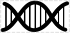
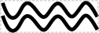
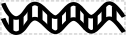

# Double-Stranded Nucleic Acid

## Associated BioPAX term(s)
Dna: http://www.biopax.org/release/biopax-level3.owl#Dna

## Recommended Glyph and Alternates
A number of variant glyphs have been proposed for dsNA, including a double-helix:

a double-helix with nucleotides:

a parallel pair of ssNA wiggles:

a parallel pair of ssNA wiggles with nucleotides:

two parallel lines:

a "ladder":

a "ladder" with 5' hooks in each direction:

Alternately, dsNA might be represented by the SBGN "nucleic acid" half-round rectangle:

## Prototypical Example

DNA fragment during assembly

## Notes
*This section left intentionally blank*
