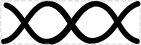
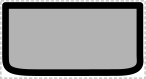

# Double-Stranded Nucleic Acid

## Associated SBO term(s)
SBO:0000251 Deoxyribonucleic acid 

## Recommended Glyph and Alternates
The RECOMMENDED glyph for dsNA is a double-helix:

An alternative is the SBGN "nucleic acid" half-round rectangle:

## Prototypical Example

DNA fragment during assembly

## Notes
Alternate BioPAX definition: Dna: http://www.biopax.org/release/biopax-level3.owl#Dna
