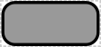

# Macromolecule

## Associated SBO term(s)
SBO:0000245 Macromolecule

## Recommended Glyph and Alternates
The macromolecule glyph is a rounded rectangle, as used in SBGN:

A deprecated alternative is a diagonally offset union of a large and small circle, intended to invoke the complex shapes of protein. It is now deprecated for being too similar to a yeast cell "shmoo" symbol:

## Prototypical Example

AraC protein, polymerized chitin

## Notes
*this section deliberately blank*
