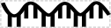
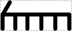

# Single-Stranded Nucleic Acid

## Associated BioPAX term(s)
Rna: http://www.biopax.org/release/biopax-level3.owl#Rna

## Recommended Glyph and Alternates
A number of variant glyphs have been proposed for ssNA, including a wiggly line:

a wiggly line with teeth:

a "comb" of a straight line with teeth:

a "comb" with an additional 5' hook:

or a small rectangular box:

Alternately, ssNA might be represented by the SBGN "nucleic acid" half-round rectangle:

## Prototypical Example

mRNA, gRNA, siRNA

## Notes
*This section left intentionally blank*
