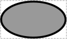

# Unspecified

## Associated BioPAX term(s)
PhysicalEntity: http://www.biopax.org/release/biopax-level3.owl#PhysicalEntity

## Recommended Glyph and Alternates
Unspecified is RECOMMENDED to be represented by the unicode "replacement character" glyph, indicating a missing or invalid symbol:

An alternative is the SBGN "generic species" glyph, which is an oval:

## Prototypical Example

An anonymous chemical species that is missing any information about its nature or intended purpose.

## Notes
The Unspecified glyph is intended for showing where a chemical species' type is missing (or, equivalently, given only the uninformative root role). It should never appear with well-curated designs or diagrams.

