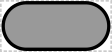

# Protein

## Associated SBO term(s)
SBO:0000252 Polypeptide Chain

## Recommended Glyph and Alternates
The protein glyph is a "pill" shape with a rectangular body and rounded ends, representing the compact space-filling mass of many proteins:

## Prototypical Example

AraC protein

## Notes
To avoid confusion with circles or ellipses, the "pill" shape SHOULD be significantly longer than it is tall, emphasizing its straight sides.

