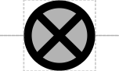

# Inert DNA Spacer

## Associated SO term(s)
SO:0002223 (Inert DNA Spacer)

## Recommended Glyph and Alternates
The inert DNA spacer glyph is a circle with an X in its middle, suggesting the intent to cancel possible interactions:

## Prototypical Example

Inserted 5' sequence intended to reduce effect of upstream genetic context on promoter behavior.

## Notes
*this section deliberately blank*