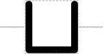

# Operator / Binding Site

## Associated SO term(s)
SO:0000057 Operator

SO:0000409 Binding Site

## Recommended Glyph and Alternates
The operator glyph is an open "cup" suggesting a binding location:

## Prototypical Example

Gal4 binding site in an activatable promoter.

## Notes
This glyph puts a "dent" in the backbone line.
