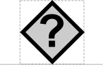
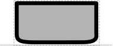

# Unspecified

## Associated SO term(s)
Unspecified: SO:0000110 Sequence Feature

## Recommended Glyph and Alternates

Unspecified is RECOMMENDED to be represented by the unicode "replacement character" glyph, indicating a missing or invalid symbol:

  

A half-rounded rectangle, the SBGN glyph for a nucleic acid, is an alternative:

  

## Prototypical Example

An anonymous sequence that is missing any information about its nature or intended purpose.

## Notes
The Unspecified glyph is intended for showing where a sequence's role is missing (or, equivalently, given only the uninformative "Sequence Feature" root role). It should never appear with well-curated designs or diagrams.
