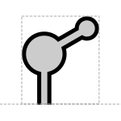

# Aptamer

## Associated SO term(s)
SO:0000031: Aptamer

## Recommended Glyph and Alternates
The aptamer glyph is a cartoon diagram of a prototypical nucleic acid secondary structure for an aptamer:

## Prototypical Example

theophylline aptamer

## Notes
*this section deliberately blank*
