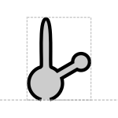

# Aptamer

## Associated SO term(s)
SO:0000031: Aptamer

## Recommended Glyph and Alternates
The proposed aptamer glyphs are two versions of a cartoon diagram of nucleic acid secondary structure like that found in aptamers:

## Prototypical Example

theophylline aptamer

## Notes
*this section deliberately blank*
