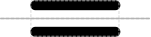
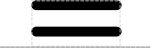

# Assembly Scar

## Associated SO term(s)
SO:0001953

## Recommended Glyph and Alternates
The assembly scar glyph is an "equal sign" image, the pattern produced by the union of a 5' sticky end and 3' sticky end glyph:

Two possible recommended backbone alignments are under consideration.  Scar on either side of backbone:

Scar on top of backbone:

## Prototypical Example

Ligated sticky ends following BioBrick assembly.

## Notes
*this section deliberately blank*
