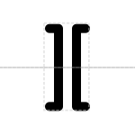

# Blunt Restriction Site

## Associated SO term(s)
SO:0001691

## Recommended Glyph and Alternates
The blunt restriction site glyph is an image of two brackets facing away from one another to make a smooth-edged gap:

## Prototypical Example

EcoRV restriction site

## Notes
*this section deliberately blank*
