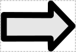
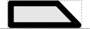

# CDS

## Associated SO term(s)
SO:0000316

## Recommended Glyph and Alternates
The coding sequence glyph is a "box" with one side bent out arrow-like to show direction:

Its recommended backbone alignment might either to the bottom or middle:

A number of variants have been proposed; their alignment will match that of CDS except when otherwise noted. 

The block arrow and User Defined rectangle are already commonly used in diagrams:

Other alternatives include a chevron:

and asymmetric "halved" versions of the current CDS or block xarrow:

## Prototypical Example

α-Hemoglobin coding sequence

## Notes

