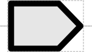
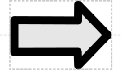

# CDS

## Associated SO term(s)
SO:0000316

## Recommended Glyph and Alternates
The coding sequence glyph is a "box" with one side bent out arrow-like to show direction:

Alternately, CDS may be represented as a block arrow:

## Prototypical Example

α-Hemoglobin coding sequence

## Notes

*this section deliberately blank*
