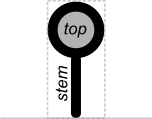
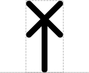
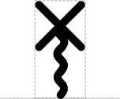
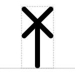

# Cleavage Site

## Associated SO term(s)
SO:0001688 (Restriction Enzyme Cleavage Junction), SO:0001687 (Restriction Enzyme Recognition Site)

SO:0001977 (Ribonuclease Site)

SO:0001956 (Protease Site)

## Recommended Glyph and Alternates
Cleavage Site is a "stem-top" glyph for describing small sites. In this system:

- the top glyph indicates the type of site (e.g., Cleavage Site)
- the stem glyph indicates whether the site affects DNA, RNA, or protein (respectively: straight, wavy, or looped)

The Cleavage Site top is an "X" suggesting slicing on top of a stem connecting to the backbone at the point where cleavage will occur (in order: DNA, RNA, Protein):

## Prototypical Example

RNAse E site, BamHI

## Notes
SO:0000061 (which was previously associated with Restriction Enzyme Recognition Site in SBOL Visual 1.0) is no longer associated with the DNA Cleavage glyph in SBOL Visual 2, as SO:0000061 refers to the binding site and not the location of cleavage.

The Ribonuclease Site, Protease Site, and Restriction Enzyme Recognition Site glyphs from SBOL Visual 1.0 are now replaced by the Cleavage Site glyph with the appropriate stem.

Describing a Restriction Enzyme Cleavage Site with a vertical line glyph on a DNA backbone (as done previously in SBOL Visual 1.0 via the Restriction Enzyme Recognition Site glyph) can persist in a SBOL Visual 2 diagram and still be considered compliant with SBOL Visual 2, where it is now classified as a Biopolymer Location (which is a superclass of cleavage sites). Thus, the Biopolymer Location glyph from SBOL Visual 2.0 is backwards compatible with the Restriction Enzyme Recognition Site glyph from SBOL Visual 1.0.

The 5' Sticky Restriction Site, 3' Sticky Restriction Site, and Blunt Restriction Site glyphs remain unchanged, and are more specific children/derivatives of the DNA-Stem Cleavage-Top glyph.

A 2A self-cleaving polypeptide region (SO:0002224) SHOULD NOT be represented by a protease site, as its cleavage mechanism is different. Instead, 2A sequences should be represented using the Polypeptide Region glyph (see example in its specification).

