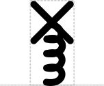

# Cleavage Site

## Associated SO term(s)
SO:0001956 (Protease Site)

SO:0001977 (Ribonuclease Site)

SO:0001687 (Restriction Enzyme Recognition Site), SO:0001688 (Restriction Enzyme Cleavage Junction)

## Recommended Glyph and Alternates
Biopolymer Location is a "stem-top" glyph for describing small sites. In this system:

- the top glyph indicates the type of site (i.e., Biopolymer Location)
- the stem glyph indicates whether the site affects DNA, RNA, or protein (respectively: straight, wavy, or looped)

The protease site top is an "X" suggesting slicing on top of a stem connecting to the backbone at the point where cleavage will occur (left to right: DNA, RNA, Protein):

The complementary Ribonuclease Site glyph is identical except that its stem is a dashed line rather than a solid line.

## Prototypical Example

RNAse E site, BamHI

## Notes
Restriction site previously also associated with SO:0000061, but that was incorrect, since it refers to the binding site and *not* the location of cleavage)

This is backwards compatible with the SBOL Visual 1.0 glyph for Restriction Site, as that is covered by the Location glyph. The SBOL Visual 1.0 glyphs for Protease Site and Ribonuclease site, however, are obsolete and superseded by the new system.