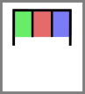
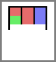

# Codon

## Associated SO term(s)
SO:0000360: Codon

SO:0000318: Start Codon

SO:0000319: Stop Codon

## Recommended Glyph and Alternates
The proposed aptamer glyphs are two versions of a cartoon diagram of nucleic acid secondary structure like that found in aptamers:

Nucleotides can be indicated with colors or letters in the boxes:

Proteins can be indicated by a letter above:

Stop and start codons might be indicated by special symbols:

.png)

Edits can be indicated by changes:

.png)

## Prototypical Example

UGA stop codon

## Notes
If accepted, there will need to be additional work done to elaborate the full specification.