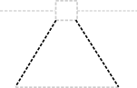

# Composite

## Associated SO term(s)
*Composite does not have an associated SO term, as it merely links a base glyph (with its own SO term) to a sub-diagram (comprising glyphs with their own associated SO terms).*

## Recommended Glyph and Alternates

The glyph for Composite is dashed "expanding lines" connecting any "base" glyph representing the more abstract composite (e.g., Omitted Detail, or Terminator, or Promoter) to a backbone diagramming the contents of the composite. Note the bounding box is indicating the location of the base glyph, and would scale with that glyph.

## Prototypical Example

An "expression cassette" containing a ribosome entry site, coding sequence, and terminator.

In this case, the recommended "base" glyph would be Engineered Region.

## Notes
An "abbreviated" representation of composite, simply indicating that more structure is available, can be made by using short lines and placing only an Omitted Detail glyph in the secondary backbone. For example, here is an example of an abbreviated composite promoter: 

and a composite with an Engineered Region of otherwise unspecified content:

