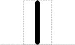

# Cut

## Associated SO term(s)
SO:0000699 (Junction, Boundary, Breakpoint)

## Recommended Glyph and Alternates
The new Cut glyph is proposed as part of introducing a systematic set of "stem-top" glyphs representing small sites affecting DNA, RNA, or protein.  The other glyphs in this system are Stability Element and Cleavage Site.

In this system:

- the stem glyph indicates whether the site affects DNA, RNA, or protein
- the top glyph indicates the type of site

### Stems
There are several proposals for the DNA / RNA / protein system for stems:

- Straight, Wavy, Looped lines:

### Tops

Cut tops:

- Circle (RECOMMENDED):

- Nothing:

X-ase tops:

- An "X":

Stability tops:

- Shield

## Prototypical Example

CRISPR-targeted insertion site, protease site

## Notes
Cut is a general glyph for all zero-length sequence features, including insertion and deletion sites and X-ase cut sites.

The proposed glyph system affects other glyphs as well, as noted above.