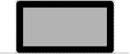

# Engineered Region

## Associated SO term(s)
SO:0000804 (Engineered Region)

## Recommended Glyph and Alternates

Engineered Region is represented by a plain rectangle suggesting a blank slate to be written upon:

## Prototypical Example

An "expression cassette" containing a ribosome entry site, coding sequence, and terminator.

## Notes
*this section deliberately blank*