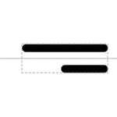

# 5' Overhang Site

## Associated SO term(s)
SO:0001932: 5' Overhang Site

SO:0001933: 3' Overhang Site

## Recommended Glyph and Alternates
The 5' overhang site glyph is an image of a strand of DNA extended on the 5' edge of its forward strand:

With a double-stranded backbone:

## Prototypical Example

EcoRI site after cleavage.

## Notes
The complementary 3' Overhang Site glyph is a reflection of the 5' Overhang Site.