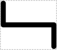
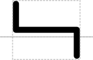

# 5' Sticky Restriction Site

## Associated SO term(s)
SO:0001975 (5' Sticky Restriction Site)

SO:0001976 (3' Sticky Restriction Site)

## Recommended Glyph and Alternates
The 5' sticky restriction site glyph is an image of the lines along which two strands of DNA will be cut into 5' sticky ends:

Verticle position with respect to the backbone might be either between a douple backbone and in a break in a single backbone:

or else above it:

## Prototypical Example

EcoRI restriction site.

## Notes
The complementary 3' Sticky Restriction Site glyph is a reflection of the 5' Sticky Restriction Site.
