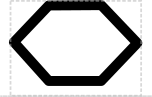

# Homology Region

## Associated SO term(s)
*No SO term currently exists*

## Recommended Glyph and Alternates
The homology region glyph is a stretched hexagon hovering above the backbone:

## Prototypical Example

*Needs a good example*

## Notes
*this section deliberately blank*
