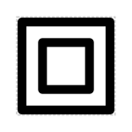
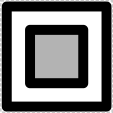
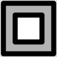
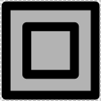
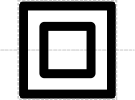
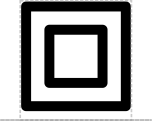

# Insulator

## Associated SO term(s)
SO:0000627

## Recommended Glyph and Alternates
The insulator glyph is a box inside another box that isolates it from its environment:

This might either have no interior (as above) or have the inner, outer, or both boxes filled:

The position of the back bone might be below, centered, or hovering below:

 
## Prototypical Example

RiboJ or BCDs

## Notes
Insulator has ambiguous interior and vertical position, so its glyph does not yet have a recommended backbone alignment or interior

