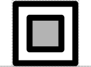

# Insulator

## Associated SO term(s)
SO:0000627

## Recommended Glyph and Alternates
The insulator glyph is a box inside another box that isolates it from its environment:

## Prototypical Example

RiboJ or BCDs

## Notes
Insulator has ambiguous interior and vertical position, so its glyph does not yet have a recommended backbone alignment or interior

