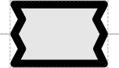

# Intron

## Associated SO term(s)
SO:0000188 (intron)

## Recommended Glyph and Alternates
An intron is designated by a boundaries interrupting CDS, each side having a two-triangle "torn out" edges, suggesting removal from an enclosing coding sequence:

## Prototypical Example

Example of a coding sequence with three domains: an N-tag (blue), C-tag (yellow), and internal region (red) interrupted by an intron that includes a gRNA non-coding RNA sequence (green):

## Notes
*this section deliberately blank*
