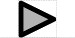

# Inverter

## Associated SO term(s)
*No SO term currently exists*

## Recommended Glyph and Alternates
The inverter glyph is a triangle, echoing the buffer glyph from electronics.  It might be either above or on the backbone.

## Prototypical Example

*Needs a good example*

## Notes
Potential conflict with proposed Specific Recombination Site glyph.