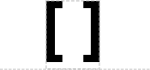

# No Glyph Assigned

## Associated SO term(s)
Any SO term that is not covered by any glyph besides the root Sequence Feature

## Recommended Glyph and Alternates

When a part has no assigned glyph it is RECOMMENDED that a user provide their own glyph. The user is also encouraged to submit the new glyph for possible adoption into the SBOLv standard.

An alternative is brackets, suggesting information that needs to be filled in:

As a best practice, it is RECOMMENDED that the name of the term be put in between the brackets.

## Prototypical Example

No Glyph Assigned is intended to be used for any Component that is not covered by other SBOL Visual glyphs.

For example, at present there is no glyph recommended for representing a transposon.

## Notes
No Glyph Assigned is intended for constructs with a defined specific role that happens to not yet be covered by available approved glyphs (other than the root "Sequence Feature"). It is more likely to appear in machine-generated diagrams than in human-generated diagrams, since humans are likely to invent and use their own glyph for the purpose.
