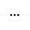
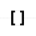
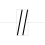
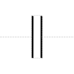

# Omitted Detail

## Associated SO term(s)
No SO term will be associated with this, as it is indicating that something is *not* being representing.

## Recommended Glyph and Alternates
The proposed omitted detail glyphs all are a break in the backbone with something to indicate that material would normally be in that location, e.g., an ellipsis:

or brackets:

or a straight or slanted "graph axis break":

## Prototypical Example

A diagram in which a sequence features is not drawn.

## Notes
All of these glyphs actually place a "break" in the nucleic acid backbone.