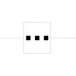

# Omitted Detail

## Associated SO term(s)
No SO term is associated with Omitted Detail, as it is indicating that something is *not* being represented.

## Recommended Glyph and Alternates
The Omitted Detail glyph is a break in the backbone with an ellipsis to indicate that material would normally be in that location:

## Prototypical Example

A diagram in which a sequence feature is not drawn.

## Notes
This glyph actually places a "break" in the nucleic acid backbone.
