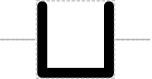

# Operator

## Associated SO term(s)
SO:0000057 Operator

Proposed alternative:
SO:0000409 Binding Site

## Recommended Glyph and Alternates
The operator glyph is a box marking a place:

Its recommended backbone alignment might be middle, bottom, or hovering above:

The glyph might also be generalized to Binding Site, which also suggests it might be an open "cup" as in the binding sites of the proposed protein language:

The notion of binding site might also simply be indicated by generalizing Restriction Enzyme Recognition Site to simply be a generic Recognition Site:

## Prototypical Example

Gal4 binding site in an activatable promoter.

## Notes
*this section deliberately blank*
