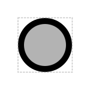

# Origin of Replication

## Associated SO term(s)
SO:0000296

## Recommended Glyph and Alternates
The origin of replication glyph is a circle suggesting the "bulge" opened in a piece of circular DNA when replication is beginning:

## Prototypical Example

human herpesvirus-6 OOR

## Notes

The label on an origin of replication glyph is RECOMMENDED as the location to label either specifically the identity of the origin of replication or the name of the entire plasmid backbone more generally.