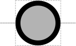

# Origin of Replication

## Associated SO term(s)
SO:0000296

## Recommended Glyph and Alternates
The origin of replication glyph is a circle suggesting the "bulge" opened in a piece of circular DNA when replication is beginning:

## Prototypical Example

oriT

## Notes
Origin of Replication has ambiguous vertical position, so its glyph does not yet have a recommended backbone alignment.  The "bulge" explanation for the glyph does suggest it should be vertically centered on the backbone, however.

