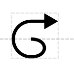

# Origin of Transfer

## Associated SO term(s)
SO:0000724: Origin of Transfer

## Recommended Glyph and Alternates
The origin of transfer glyph is circular like origin of replication, but also includes an outbound arrow:

## Prototypical Example

oriT

## Notes
*This section left deliberately blank*