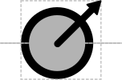

# Origin of Transfer

## Associated SO term(s)
SO:0000724: Origin of Transfer

## Recommended Glyph and Alternates
The origin of transfer glyph is circular like origin of replication, but either has an outbound arrow:

or else spirals outward toward a new destination rather than being a closed circle. Two slightly different variants of spiral are proposed for consideration:

## Prototypical Example

oriT

## Notes
*This section left deliberately blank*