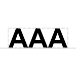

# PolyA Site

## Associated SO term(s)
SO:0000553: polyA Site

## Recommended Glyph and Alternates
The polyA site glyph is a sequence of As sitting atop the backbone:

## Prototypical Example

polyA tail on mammalian coding sequence

## Notes
*This section left deliberately blank*