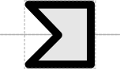

# Polypeptide Region

## Associated SO term(s)
SO:0000839 (polypeptide region)

## Recommended Glyph and Alternates
The polypeptide region glyph is a chevron suggesting a fragment of a coding sequence:

For polypeptide regions at the extreme 5' end of a coding sequence, the RECOMMENDED alternative is instead a truncated chevron that can be put flush with the left side of a CDS glyph:

## Prototypical Example

degradation tag on a protein coding sequence
nuclear localization tag on a protein coding sequence

This glyph is intended to be used in composition or superposition with the glyph for the coding sequence of which the polypeptide regions are fragments: Example of a coding sequence with three an N-tag (blue), C-tag (yellow), and internal region (red):

## Notes
*This section left deliberately blank*