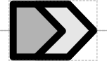

# Polypeptide Region

## Associated SO term(s)
SO:0000839 (polypeptide region)

## Recommended Glyph and Alternates
A polypeptide region inside a coding sequence is indicated by insertion of triangular boundaries inside of the CDS, parallel to the 3' side of the CDS.  This will produce chevron segments on the 3' side and a CDS shape on the 5' side:

## Prototypical Example

degradation tag on a protein coding sequence

nuclear localization tag on a protein coding sequence

coding sequence for the membrane-crossing region of a protein

This glyph is intended to be used in composition or superposition with the glyph for the coding sequence of which the polypeptide regions are fragments: Example of a coding sequence with three designated domains, an N-tag (blue), C-tag (yellow), and internal region (red):

## Notes
*This section left deliberately blank*