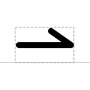

# Primer Binding Site

## Associated SO term(s)
SO:0005850

## Recommended Glyph and Alternates
The primer binding site glyph is a line with a bent end suggesting a partially complementary strand of nucleic acid attaching to the backbone:

## Prototypical Example

seq-F

## Notes
*this section deliberately blank*
