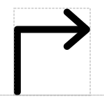

# Promoter Site

## Associated SO term(s)
SO:0000167

## Recommended Glyph and Alternates
The promoter glyph is a bent arrow pointing forward, suggesting the action of transcription from its transcription start site:

## Prototypical Example

The lacYZA promoter

## Notes
*this section deliberately blank*
