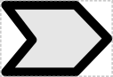
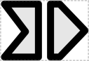
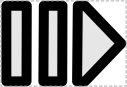

# Protein Domain

## Associated SO term(s)
SO:0000417 Polypeptide Domain

## Recommended Glyph and Alternates
A number of proposals have been made for Protein Domain glyphs. These are:

* A chevron, which composes nicely with the standard CDS pentagon

* A chevron with a vertical break:

* A plain rectangle (the same as user defined):

* A broken CDS pentagon

* A broken arrow (i.e., broken alternate CDS)

* A CDS pentagon with a chevron break:

## Prototypical Example

VP64 activation domain

## Notes
Protein domain should have the same recommended vertical position as CDS, but CDS does not have a recommended vertical position yet, so these proposals do not either.