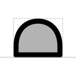

# Ribosome Entry Site

## Associated SO term(s)
SO:0000139: Ribosome Entry Site
SO:0000204: 5’UTR

## Recommended Glyph and Alternates
The ribosome entry promoter glyph is a half-ovoid sitting on the backbone, suggesting an attached ribosome beginning transcription:

## Prototypical Example

T7g10 ribosome binding site

## Notes
*this section deliberately blank*
