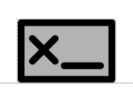

# Signature

## Associated SO term(s)
SO:0001978

## Recommended Glyph and Alternates
The signature glyph is a box sitting atop the backbone with an X and line inside it, suggesting a signature on a form:

## Prototypical Example

DNA Barcode

## Notes
*this section deliberately blank*
