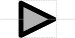

# Specific Recombination Site

## Associated SO term(s)
SO:0000299: Specific Recombination Site

## Recommended Glyph and Alternates
The specific recombination site glyph is a triangle, centered on the backbone, as has appeared in a number of recombinase circuit papers:

## Prototypical Example

flippase recognition target (FRT) site

## Notes
*This section left deliberately blank*
