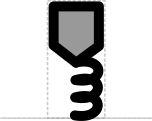

# Stability Element

## Associated SO term(s)
*No SO term is currently associated with DNA stability.*

SO:0001979 (RNA Stability Element)

SO:0001955, SO:0001546 (Protein Stability Element)

## Recommended Glyph and Alternates
Stability Element is a "stem-top" glyph for describing small sites. In this system:

- the top glyph indicates the type of site (e.g., Stability Element)
- the stem glyph indicates whether the site affects DNA, RNA, or protein (respectively: straight, wavy, or looped)

The top for a Stability Element is a pentagon suggesting the shape of a shield, on top of a stem connecting to the backbone at the point where the stability element is located (in order: DNA, RNA, Protein):

## Prototypical Example

PEST tag, 3’ Hairpin

## Notes
RNA Stability Element glyph was previously also associated with SO:0001957, but that SO term has been declared obsolete in Sequence Ontology.

This glyph is not backwards compatible with SBOL Visual 1.0.

Despite both being stem-top glyphs, Biopolymer Location is not a parent to Stability Element, since the length of a Stability Element is typically multiple bases / amino acids.

