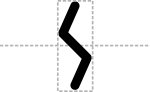

# Sticky End Restriction Enzyme Cleavage Site

## Associated SO term(s)
SO:0001692 (unspecified direction)

SO:0001975 (5' Sticky Restriction Site)

SO:0001976 (3' Sticky Restriction Site)

## Recommended Glyph and Alternates
A sticky restriction site of unspecified direction is an angled set of cuts:

The 5' sticky restriction site glyph is an image of the lines along which two strands of DNA will be cut into 5' sticky ends:

## Prototypical Example

EcoRI restriction site.

## Notes
The complementary 3' Sticky Restriction Site glyph is a reflection of the 5' Sticky Restriction Site.

5' Sticky Restriction Site has ambiguous vertical position, so its glyph does not yet have a recommended backbone alignment.

