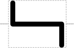
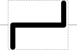
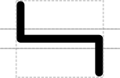

# Sticky End Restriction Enzyme Cleavage Site

## Associated SO term(s)
SO:0001975 (5' Sticky Restriction Site)

SO:0001976 (3' Sticky Restriction Site)

## Recommended Glyph and Alternates
The 5' sticky restriction site glyph is an image of the lines along which two strands of DNA will be cut into 5' sticky ends, and the complementary 3' Sticky Restriction Site glyph is a reflection of the 5' Sticky Restriction Site. Vertical position with respect to the backbone is in a break in a single backbone (in order: five-prime, three-prime):

and between strands of a double backbone (in order: five-prime double stranded, three-prime double stranded):

## Prototypical Example

EcoRI restriction site.

## Notes

*this section deliberately blank*
