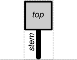
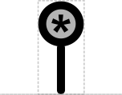
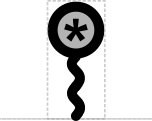

# Stop Site

## Associated SO term(s)
SO:0000616 Transcription End Site

SO:0000319 Stop Codon, SO:0000327 Coding End, Translation Termination Site, Translation End
## Recommended Glyph and Alternates

Transcription/Translation End Point is a "stem-top" glyph for describing small sites. In this system:

- the top glyph indicates the type of site (e.g., Biopolymer Location)
- the stem glyph indicates whether the site affects DNA, RNA, or protein (respectively: straight, wavy, or looped)

The Transcription/Translation End Point top is an asterisk in a circle (in order: transcription, translation):

## Prototypical Example

Location where a terminator causes transcription to stop, stop codon 

## Notes

Note that the number of points in the asterisk is not specified, accomodating font differences.
