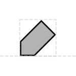

# Tag

## Associated SO term(s)
SO:0000324: Tag

## Recommended Glyph and Alternates
The tag glyph is a diagonal rectangle with clipped corners, reminiscent of a stereotypical paper gift tag:

## Prototypical Example

PEST tag

## Notes
*This section left deliberately blank*